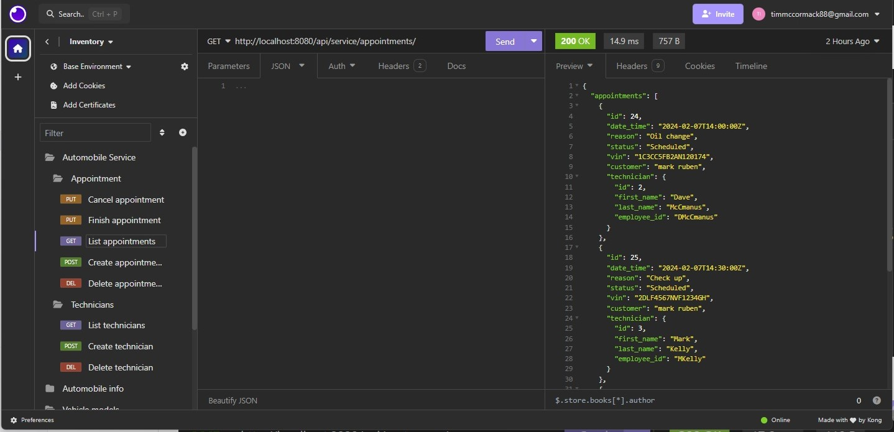
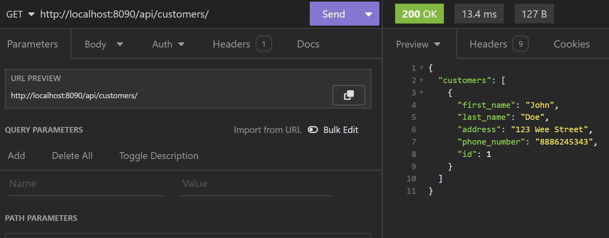

# CarCar
CarCar is a car dealership application -- making it easier to manage inventory, services, and sales.

Team:

* Tim McCormack - Service Microservice
* Noah Harshbarger - Sales Microservice

## Design

## Service microservice

The service microservice has 2 models and one Value Object (VO): Technician,Appointment and AutomobileVO. In the service model I created a foreign key for Technician because it required data from models and VO's.

## Sales microservice

The sales microservice has three models and one Value Object (VO): Salesperson, Customer, Sale, and AutomobileVO.

For the sales model, foreign keys were created for AutomobileVO, Salesperson, and Customer because it required the data from those models/VOs.

## Instructions to Run

1. Fork the Repo
2. Clone the Repo
3. Run the following code in the terminal:
    - `docker volume create beta-data`
    - `docker-compose build`
    - `docker-compose up`
4. Verify that each Docker container is running.
5. View the app @ http://localhost:3000/

## Design

### URL Endpoints/Samples

In the following images, the relevant URL, endpoint, HTTP method, and request/response bodies are visible. The order will be GET, POST, PUT, and DELETE.

## Service

## List Technician

## Create Technician

## Delete Technician

## List appointment

## Create appointment

## Delete appointment

The Service model uses a Foreign Key in Technician

## Sales

### List Salespeople

### List Salespeople

### Create a Saleperson

### Delete a Salesperson

### List Customers

### Create a Customer

### Delete a Customer

The Sales Model is used with foreign keys: `automobile`, `salesperson`, and `customer` are used.
